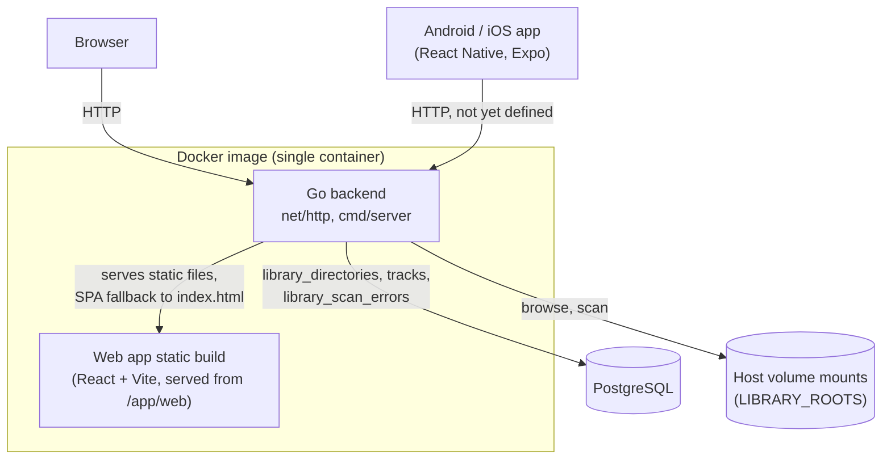

# opusflow Architecture

Living reference for the system as a whole — components, interfaces, frameworks,
schema, and the load-bearing decisions behind them. Per-feature rationale in full
(alternatives considered, pros/cons) lives in [`docs/tdr/`](tdr/); this document
summarizes and links out rather than duplicating it. Update this file whenever a
feature changes a component boundary, adds a table, or reverses an earlier
decision — it should always describe the system as it is today, not as it was
designed.

**Status**: first product feature shipped — adding a local directory to the
music library (browse, add, async scan, remove); see
[TDR 001](tdr/001_add_local_directory_design.md). Mobile is still an
untouched Expo starter.

## 1. System context

The backend and web app are built and shipped as **one** Docker image (root
`Dockerfile`): a multi-stage build compiles the Go binary and the Vite static
build separately, then copies both into a minimal `distroless` runtime image.
The Go binary serves the API and the static web build from the same process —
there is no separate web server/container. The mobile app is a native
Android/iOS build (via Expo), not part of this image.

## 2. Core stack

| Concern | Choice | Notes |
|---|---|---|
| Backend | Go 1.24, stdlib `net/http` | `backend/cmd/server` + `backend/internal/httpserver`; no router library yet — Go 1.22+'s `ServeMux` method+path patterns cover current needs |
| Web frontend | React 19 + Vite + TypeScript | `web/`; no router/state library yet — still only one real screen (see §6) |
| Mobile | Expo (React Native) + TypeScript | `mobile/`, default `create-expo-app blank-typescript` template, not yet customized |
| Database | PostgreSQL 17 | `backend/internal/db` (`lib/pq` driver, hand-rolled embed-based migration runner — no ORM/migration-library dependency); wired up by [TDR 001](tdr/001_add_local_directory_design.md) |
| Audio tag/duration parsing | `github.com/dhowden/tag` (tags) + hand-rolled per-format duration parsers | `backend/internal/library/scan`; see TDR 001 |
| Package manager (web/mobile) | pnpm workspaces, pinned via corepack (`pnpm@9` — `pnpm@11`+ requires Node 22, this environment has Node 20) | root `pnpm-workspace.yaml` covers `web/` and `mobile/` |
| Packaging | Docker (see §1) | root `Dockerfile` + `docker-compose.yml` |

## 3. Components

- **`backend/cmd/server`** — process entrypoint. Reads `PORT` (default
  `8080`), `STATIC_DIR` (set to `/app/web` in the Docker image; empty in
  local `go run`, which then serves API-only), `DATABASE_URL`, and
  `LIBRARY_ROOTS` (comma-separated absolute paths, one per Docker volume
  mount — the only filesystem locations the library endpoints may browse or
  register directories under). Opens Postgres, runs migrations, and wires up
  `library.Service` before starting the HTTP server.
- **`backend/internal/httpserver`** — builds the root `http.Handler`:
  `GET /health`; the library endpoints (below); and, when `STATIC_DIR` is
  set, a static file server for the built web app with SPA fallback
  (unmatched GETs serve `index.html` rather than 404, so client-side routing
  survives a refresh once the web app adds a router).
  - `GET /api/library/roots` — list configured roots
  - `GET /api/library/browse?path=` — list a path's immediate subdirectories
  - `GET /api/library/directories` — list registered directories (status,
    progress, track count, file errors)
  - `POST /api/library/directories` `{"path": "..."}` — register + async-scan
  - `DELETE /api/library/directories/{id}` — remove (cascades tracks)
- **`backend/internal/db`** — Postgres connection (`Open`) and schema
  migrations (`Migrate`, embedding `internal/db/migrations/*.sql`, tracked in
  a `schema_migrations` table).
- **`backend/internal/library`** — the library domain: `Roots` (filesystem
  containment/browsing scoped to `LIBRARY_ROOTS`), `Store` (Postgres
  persistence for directories/tracks/file errors), `Service` (orchestrates
  add/remove/list/browse, starts each scan as a background goroutine so
  `POST /api/library/directories` returns before the scan finishes).
- **`backend/internal/library/scan`** — the scanning engine: recursive
  directory walk, audio format detection by extension (mp3/flac/m4a/aac/
  ogg/wav), tag extraction (`dhowden/tag`, filename fallback when a file
  carries no tags), and per-file error tolerance (a bad file is skipped and
  recorded, not fatal to the scan).
- **`backend/internal/library/scan/duration`** — per-format audio duration:
  exact for WAV/FLAC/MP4, best-effort for OGG (last page granule position)
  and MP3 (Xing/Info VBR header if present, else a bitrate/filesize estimate).
- **`web/`** — first real screen: `src/pages/LibraryPage.tsx` (directory
  list with live scan progress, polled while any directory is `scanning`)
  and `src/components/DirectoryPicker.tsx` (root selector + breadcrumb
  folder browser, opened as an in-page modal — not a separate route, so no
  router was added; see §6). `src/api/library.ts` is the typed fetch client.
- **`mobile/`** — untouched Expo starter. No navigation or API client added
  yet.

## 4. Data model

Postgres, migrated via `backend/internal/db` (see §3):

- **`library_directories`** — one row per registered directory: `root`,
  `path` (unique — enforces AC-2's exact-duplicate rejection), `status`
  (`scanning` / `complete` / `failed`), `files_processed`, `files_total`,
  `error`, `created_at`.
- **`tracks`** — one row per imported audio file: `directory_id` (FK,
  `ON DELETE CASCADE`), `path`, `title`, `artist`, `album`, `track_number`,
  `year`, `genre`, `duration_seconds`.
- **`library_scan_errors`** — one row per file a scan couldn't process:
  `directory_id` (FK, `ON DELETE CASCADE`), `path`, `error`. Isolated file
  errors don't change the directory's `status` away from `complete` — only
  a job-level failure (the registered directory itself becoming unreadable)
  sets `status = 'failed'`.

## 5. Feature-by-feature decision log

Full write-ups (alternatives evaluated, pros/cons) are in `docs/tdr/`; this is
an index with the one-line "why" for each, newest first.

| Feature | TDR | Chosen approach | Why (one line) |
|---|---|---|---|
| Add local directory to library | [001](tdr/001_add_local_directory_design.md) | Async goroutine-based scan; server-side directory picker scoped to multiple `LIBRARY_ROOTS`; skip-and-continue per-file error handling | Matches real multi-volume households and real-world tagging inconsistency without over-building (no job queue, no router) |

## 6. Deferred / future work

- **API contract between backend and mobile app** — not designed yet; the
  mobile app has no networking code.
- **Router/state library choice for the web app** — still deferred: the
  library feature's picker is an in-page modal, not a second route, so only
  one screen exists yet. Revisit when a feature actually needs a second page.
- **VBRI-only MP3 duration** — the duration parser supports the Xing/Info
  VBR header (the common case); an MP3 with only a VBRI header falls back to
  the bitrate/filesize estimate, which is less accurate for that rare case.
- **Symlink handling during directory scans** — not specifically handled;
  `filepath.WalkDir` follows the OS's normal (non-recursive-symlink)
  traversal semantics.
