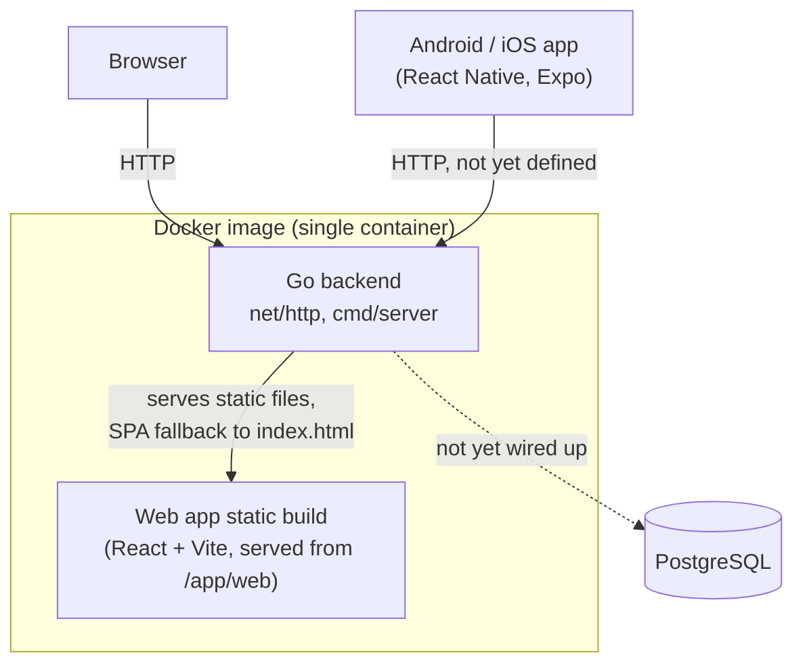

# opusflow Architecture

Living reference for the system as a whole — components, interfaces, frameworks,
schema, and the load-bearing decisions behind them. Per-feature rationale in full
(alternatives considered, pros/cons) lives in [`docs/tdr/`](tdr/); this document
summarizes and links out rather than duplicating it. Update this file whenever a
feature changes a component boundary, adds a table, or reverses an earlier
decision — it should always describe the system as it is today, not as it was
designed.

**Status**: workspaces are scaffolded (health endpoint + static web serving,
default Vite/Expo starter screens). No product features are built yet.

## 1. System context

The backend and web app are built and shipped as **one** Docker image (root
`Dockerfile`): a multi-stage build compiles the Go binary and the Vite static
build separately, then copies both into a minimal `distroless` runtime image.
The Go binary serves the API and the static web build from the same process —
there is no separate web server/container. The mobile app is a native
Android/iOS build (via Expo), not part of this image.

## 2. Core stack

| Concern | Choice | Notes |
|---|---|---|
| Backend | Go 1.24, stdlib `net/http` | `backend/cmd/server` + `backend/internal/httpserver`; no router library yet — Go 1.22+'s `ServeMux` method+path patterns cover current needs |
| Web frontend | React 19 + Vite + TypeScript | `web/`, default `create-vite react-ts` template, not yet customized |
| Mobile | Expo (React Native) + TypeScript | `mobile/`, default `create-expo-app blank-typescript` template, not yet customized |
| Database | PostgreSQL 17 | declared in `docker-compose.yml`, not yet read by any backend code — wired up when the first feature needs persistence |
| Package manager (web/mobile) | pnpm workspaces, pinned via corepack (`pnpm@9` — `pnpm@11`+ requires Node 22, this environment has Node 20) | root `pnpm-workspace.yaml` covers `web/` and `mobile/` |
| Packaging | Docker (see §1) | root `Dockerfile` + `docker-compose.yml` |

## 3. Components

- **`backend/cmd/server`** — process entrypoint. Reads `PORT` (default
  `8080`) and `STATIC_DIR` (set to `/app/web` in the Docker image; empty in
  local `go run`, which then serves API-only).
- **`backend/internal/httpserver`** — builds the root `http.Handler`:
  `GET /health` (JSON `{"status":"ok"}`), and, when `STATIC_DIR` is set, a
  static file server for the built web app with SPA fallback (unmatched GETs
  serve `index.html` rather than 404, so client-side routing survives a
  refresh once the web app adds a router).
- **`web/`** — untouched Vite/React starter. No routing, state management, or
  API client added yet.
- **`mobile/`** — untouched Expo starter. No navigation or API client added
  yet.

## 4. Data model

_Nothing yet — no schema, no migrations. PostgreSQL is provisioned in
`docker-compose.yml` ahead of need, matching the stack decision, but nothing
reads `DATABASE_URL` yet._

## 5. Feature-by-feature decision log

Full write-ups (alternatives evaluated, pros/cons) are in `docs/tdr/`; this is
an index with the one-line "why" for each, newest first.

| Feature | TDR | Chosen approach | Why (one line) |
|---|---|---|---|

## 6. Deferred / future work

- **API contract between backend and mobile app** — not designed yet; the
  mobile app has no networking code.
- **Router/state library choice for the web app** — deferred until the first
  feature needs more than one screen.
- **Postgres wiring (connection pool, migrations tool)** — deferred until the
  first feature needs persistence.
