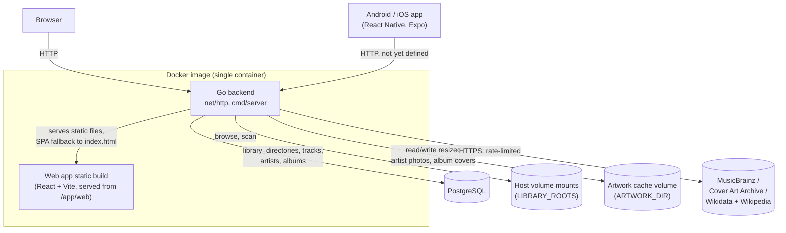

# opusflow Architecture

Living reference for the system as a whole — components, interfaces, frameworks,
schema, and the load-bearing decisions behind them. Per-feature rationale in full
(alternatives considered, pros/cons) lives in [`docs/tdr/`](tdr/); this document
summarizes and links out rather than duplicating it. Update this file whenever a
feature changes a component boundary, adds a table, or reverses an earlier
decision — it should always describe the system as it is today, not as it was
designed.

**Status**: three product features shipped — adding a local directory to the
music library (browse, add, async scan, remove; [TDR 001](tdr/001_add_local_directory_design.md)),
a Home screen plus Artist/Album/Song browsing
([TDR 002](tdr/002_home_and_browsing_design.md)), and artist/album artwork
plus MusicBrainz/Wikipedia-sourced facts and bio
([TDR 003](tdr/003_artwork_and_info_design.md)). Mobile is still an
untouched Expo starter.

## 1. System context

The backend and web app are built and shipped as **one** Docker image (root
`Dockerfile`): a multi-stage build compiles the Go binary and the Vite static
build separately, then copies both into a minimal `distroless` runtime image.
The Go binary serves the API and the static web build from the same process —
there is no separate web server/container. The mobile app is a native
Android/iOS build (via Expo), not part of this image.

## 2. Core stack

| Concern | Choice | Notes |
|---|---|---|
| Backend | Go 1.24, stdlib `net/http` | `backend/cmd/server` + `backend/internal/httpserver`; no router library yet — Go 1.22+'s `ServeMux` method+path patterns cover current needs |
| Web frontend | React 19 + Vite + TypeScript + `react-router` | `web/`; router added by [TDR 002](tdr/002_home_and_browsing_design.md) — no separate state-management library yet |
| Mobile | Expo (React Native) + TypeScript | `mobile/`, default `create-expo-app blank-typescript` template, not yet customized |
| Database | PostgreSQL 17 | `backend/internal/db` (`lib/pq` driver, hand-rolled embed-based migration runner — no ORM/migration-library dependency); wired up by [TDR 001](tdr/001_add_local_directory_design.md) |
| Audio tag/duration parsing | `github.com/dhowden/tag` (tags) + hand-rolled per-format duration parsers | `backend/internal/library/scan`; see TDR 001 |
| Artwork/info sourcing | MusicBrainz + Cover Art Archive + Wikidata/Wikipedia (no API key, descriptive `User-Agent`) | `backend/internal/library/enrich`; `golang.org/x/image/draw` for resizing; see [TDR 003](tdr/003_artwork_and_info_design.md) |
| Package manager (web/mobile) | pnpm workspaces, pinned via corepack (`pnpm@9` — `pnpm@11`+ requires Node 22, this environment has Node 20) | root `pnpm-workspace.yaml` covers `web/` and `mobile/` |
| Packaging | Docker (see §1) | root `Dockerfile` + `docker-compose.yml` |

## 3. Components

- **`backend/cmd/server`** — process entrypoint. Reads `PORT` (default
  `8080`), `STATIC_DIR` (set to `/app/web` in the Docker image; empty in
  local `go run`, which then serves API-only), `ARTWORK_DIR` (optional, like
  `STATIC_DIR` — unset disables embedded-art saving and the enrichment job
  entirely rather than erroring), `DATABASE_URL`, and `LIBRARY_ROOTS`
  (comma-separated absolute paths, one per Docker volume mount — the only
  filesystem locations the library endpoints may browse or register
  directories under). Opens Postgres, runs migrations, wires up
  `library.Service` (and, when `ARTWORK_DIR` is set, an `enrich.Job` run
  once at startup after migrations succeed — TDR 003's backfill trigger)
  before starting the HTTP server.
- **`backend/internal/httpserver`** — builds the root `http.Handler`:
  `GET /health`; the library endpoints (below); when `ARTWORK_DIR` is set, a
  static file server for it under `/artwork/`; and, when `STATIC_DIR` is
  set, a static file server for the built web app with SPA fallback
  (unmatched GETs serve `index.html` rather than 404, so client-side routing
  survives a refresh).
  - `GET /api/library/roots` — list configured roots
  - `GET /api/library/browse?path=` — list a path's immediate subdirectories
  - `GET /api/library/directories` — list registered directories (status,
    progress, track count, file errors)
  - `POST /api/library/directories` `{"path": "..."}` — register + async-scan
  - `DELETE /api/library/directories/{id}` — remove (cascades tracks, then
    orphaned artists/albums)
  - `GET /api/library/artists` / `GET /api/library/albums` /
    `GET /api/library/songs` — paginated, sorted (`recent`/`name`), filtered
    (`genre`, `year`, free-text `q`) listings; see
    [TDR 002](tdr/002_home_and_browsing_design.md)
  - `GET /api/library/artists/{id}` — artist detail (with their albums)
  - `GET /api/library/albums/{id}` — album detail (with its track listing)
- **`backend/internal/db`** — Postgres connection (`Open`) and schema
  migrations (`Migrate`, embedding `internal/db/migrations/*.sql`, tracked in
  a `schema_migrations` table).
- **`backend/internal/library`** — the library domain: `Roots` (filesystem
  containment/browsing scoped to `LIBRARY_ROOTS`), `Store` (Postgres
  persistence for directories/tracks/file errors/artists/albums, plus the
  enrichment query/update methods satisfying `enrich.Store`), `Service`
  (orchestrates add/remove/list/browse and artist/album/song listing/detail,
  starts each scan as a background goroutine so `POST /api/library/directories`
  returns before the scan finishes, then runs one `enrich.Job` pass under a
  fresh background context once the scan completes — TDR 003's post-scan
  trigger).
- **`backend/internal/library/scan`** — the scanning engine: recursive
  directory walk, audio format detection by extension (mp3/flac/m4a/aac/
  ogg/wav), tag extraction (`dhowden/tag`, filename fallback when a file
  carries no tags, embedded cover art via `Picture()` when present), and
  per-file error tolerance (a bad file is skipped and recorded, not fatal to
  the scan).
- **`backend/internal/library/scan/duration`** — per-format audio duration:
  exact for WAV/FLAC/MP4, best-effort for OGG (last page granule position)
  and MP3 (Xing/Info VBR header if present, else a bitrate/filesize estimate).
- **`backend/internal/library/enrich`** — the background artwork/info
  worker (TDR 003): `MusicBrainz` (search + lookup, rate-limited to its
  usage policy), `CoverArtArchive` (album covers by release-group MBID),
  `Wikidata` (resolves a MusicBrainz "wikidata" relation into a Commons
  photo filename and an English Wikipedia article title, then fetches
  each), `ImageStore` (resizes into thumb/full JPEG variants under
  `ARTWORK_DIR`), and `Job` (orchestrates all of the above against a
  `Store` interface `*library.Store` satisfies — same "leaf package,
  dependency points one way" shape as `scan`/`library.Store.InsertTrack`).
  `Job.Run` processes every artist/album with any of art/facts/bio still
  `pending`/`failed`, not scoped to a particular scan, tracking each kind's
  outcome independently.
- **`web/`** — `react-router` routes wrapped in `src/components/AppLayout.tsx`
  (persistent Home/Artists/Albums/Songs/Library header nav):
  `src/pages/HomePage.tsx` (library snapshot + recently-added previews),
  `src/pages/ArtistsPage.tsx` / `AlbumsPage.tsx` / `SongsPage.tsx` (paginated,
  sortable, filterable index pages, sharing fetch/pagination logic via
  `src/hooks/useListPage.ts`), `src/pages/ArtistDetailPage.tsx` /
  `AlbumDetailPage.tsx`, and `src/pages/LibraryPage.tsx` (directory list with
  live scan progress, polled while any directory is `scanning`, plus
  `src/components/DirectoryPicker.tsx` — root selector + breadcrumb folder
  browser, opened as an in-page modal). `src/components/ArtTile.tsx` (real
  artwork vs. a refined placeholder glyph) and `src/components/InfoBlock.tsx`
  (facts-chip row + optional bio/description) are shared across every page
  that renders artist/album art (TDR 003). `src/api/library.ts` is the typed
  fetch client.
- **`mobile/`** — untouched Expo starter. No navigation or API client added
  yet.

## 4. Data model

Postgres, migrated via `backend/internal/db` (see §3):

- **`library_directories`** — one row per registered directory: `root`,
  `path` (unique — enforces AC-2's exact-duplicate rejection), `status`
  (`scanning` / `complete` / `failed`), `files_processed`, `files_total`,
  `error`, `created_at`.
- **`tracks`** — one row per imported audio file: `directory_id` (FK,
  `ON DELETE CASCADE`), `path`, `title`, `artist`, `album`, `track_number`,
  `year`, `genre`, `duration_seconds`, plus `artist_id`/`album_id` (FKs, see
  below).
- **`library_scan_errors`** — one row per file a scan couldn't process:
  `directory_id` (FK, `ON DELETE CASCADE`), `path`, `error`. Isolated file
  errors don't change the directory's `status` away from `complete` — only
  a job-level failure (the registered directory itself becoming unreadable)
  sets `status = 'failed'`.
- **`artists`** — one row per distinct artist name (including a real,
  empty-name "Unknown Artist" row for untagged tracks), `name` unique. Added
  by [TDR 002](tdr/002_home_and_browsing_design.md); upserted as tracks are
  imported, deleted once its last track is gone (see `tracks.InsertTrack` /
  `Store.RemoveDirectory`'s orphan cleanup). [TDR 003](tdr/003_artwork_and_info_design.md)
  added `musicbrainz_id` (cached once matched), `photo_thumb_path`/
  `photo_path` + `art_status`, `formed_year`/`country`/`genres` +
  `facts_status`, and `bio`/`bio_source_url` + `bio_status` — three
  independent `enrich_status` (`pending`/`found`/`not_found`/`failed`)
  columns, one per kind, rather than a single combined status.
- **`albums`** — one row per `(title, artist_id)` pair, `year`. Same
  upsert/orphan-cleanup lifecycle as `artists`, and the same TDR 003
  extension shape: `musicbrainz_id`, `cover_thumb_path`/`cover_path` +
  `art_status`, `label`/`country`/`genres` + `facts_status`,
  `description`/`description_source_url` + `description_status`.

## 5. Feature-by-feature decision log

Full write-ups (alternatives evaluated, pros/cons) are in `docs/tdr/`; this is
an index with the one-line "why" for each, newest first.

| Feature | TDR | Chosen approach | Why (one line) |
|---|---|---|---|
| Artist/album artwork and info | [003](tdr/003_artwork_and_info_design.md) | Embedded-tag art first, MusicBrainz + Cover Art Archive + Wikidata/Wikipedia fallback via a background `enrich.Job`; three independent per-kind statuses; files on disk under `ARTWORK_DIR`, not DB blobs | Free/open/no-API-key sources matching the project's anti-proprietary-protocol stance; a background job (not inline with scanning) respects MusicBrainz's rate limit and doubles as backfill for pre-existing libraries |
| Home screen & library browsing | [002](tdr/002_home_and_browsing_design.md) | Normalized `artists`/`albums` tables (upserted at scan time, orphan-cleaned on directory removal); numbered pagination; `react-router` added | Gives Artist/Album detail pages stable IDs to route by and a natural home for future streaming-service artist linkage |
| Add local directory to library | [001](tdr/001_add_local_directory_design.md) | Async goroutine-based scan; server-side directory picker scoped to multiple `LIBRARY_ROOTS`; skip-and-continue per-file error handling | Matches real multi-volume households and real-world tagging inconsistency without over-building (no job queue, no router) |

## 6. Deferred / future work

- **API contract between backend and mobile app** — not designed yet; the
  mobile app has no networking code.
- **Full artist/album/song browsing beyond the current index+detail pages** —
  no playback, no artist-following (per `docs/vision.md`); a song's only
  navigation target today is its album.
- **Artwork match correctness** — the enrichment job accepts MusicBrainz's
  top search result with no confidence threshold (TDR 003); an ambiguous
  or misspelled name can land the wrong photo/cover with no way to correct
  it short of a database edit — no manual override/re-match UI exists yet.
- **VBRI-only MP3 duration** — the duration parser supports the Xing/Info
  VBR header (the common case); an MP3 with only a VBRI header falls back to
  the bitrate/filesize estimate, which is less accurate for that rare case.
- **Symlink handling during directory scans** — not specifically handled;
  `filepath.WalkDir` follows the OS's normal (non-recursive-symlink)
  traversal semantics.
